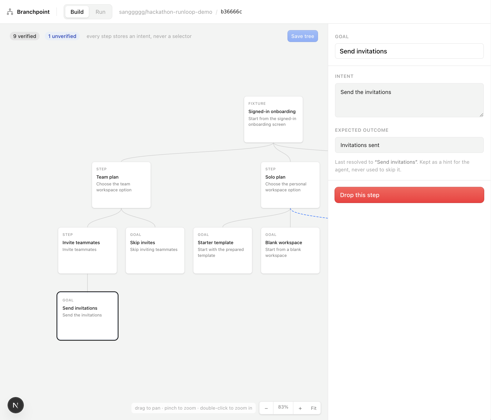
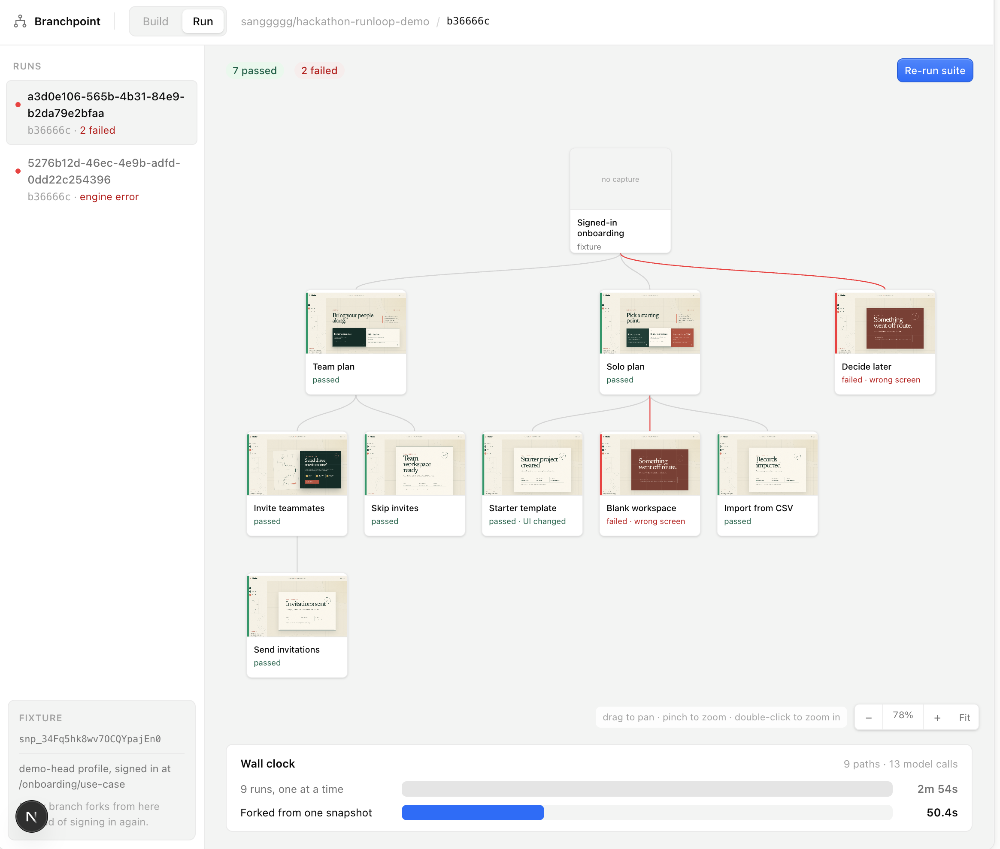

# Branchpoint

**Scenario-based browser QA that runs the shared path once, snapshots the exact
browser and sandbox state at each branchpoint, carries forward the shared
model-session prefix, then recursively forks every remaining path.**

Selectors remember *where* a control was. Branchpoint remembers *what the user
intended*, so the same QA tree can survive UI changes and run again on every
commit.

## Build the intent tree

Describe goals and actions in plain language. Build stores intent—not
selectors—and lets one fixture split repeatedly into nested execution paths.

[](docs/images/branchpoint-build.png)

## Run every path

Branchpoint restores the shared fixture, recursively forks at each split, and
shows passes, failures, and UI changes on the complete execution tree.

[](docs/images/branchpoint-run.png)

```shell
branchpoint run .
  ✔  Team plan                                     passed                              16.7s
  ✔  Team plan → Invite teammates                  passed                               7.4s
  ✔  Team plan → Invite teammates → Send invitationspassed                              13.6s
  ✔  Team plan → Skip invites                      passed                               9.3s
  ✔  Solo plan                                     passed                              16.8s
  ⚠  Solo plan → Starter template                  UI changed, followed anyway          8.3s
  ✖  Solo plan → Blank workspace                   landed on an error screen            7.5s
  ✔  Solo plan → Import from CSV                   passed                               8.7s
  ✖  Decide later                                  nothing on the page matched         16.0s

  7 passed   2 failed   1 healed

  Failed paths
    Solo plan → Blank workspace
      "Blank workspace" button resolved, but the next screen was not the expected one.
    Decide later
      The stored intent "Defer onboarding for now" matched nothing on the page. This is a stale step, not a broken app — reword or drop it in Build.

  42.9s wall clock · 9 branches from one snapshot · 2m 27s if run one at a time
  $0.00 · 13 model calls
```

## Measured across three controlled runs

Each strategy ran the same eight-test agent workload with the same model,
tools, and task-ready Runloop fixture. Every included run passed its assertions.

| Strategy | Mean wall time ↓ | Mean LLM cost ↓ |
|---|---:|---:|
| **Branchpoint — shared prefix + snapshot fork** | **66.8s** | **$0.150** |
| One sandbox — complete trajectories sequentially | 171.6s | $0.198 |
| N sandboxes — complete trajectories in parallel | 76.1s | $0.188 |

Against sequential execution, Branchpoint was **61.1% faster** and used
**24.2% less LLM cost**. Against full N-sandbox fan-out, it was **12.2% faster**
and used **20.3% less LLM cost**.

These are the means of Trials 1–3, the first three consecutive controlled
trials. A fresh cache nonce was added before every strategy, preventing cache
reuse from earlier strategies or trials while preserving the cache behavior
naturally available within that strategy. LLM cost is Anthropic upstream
inference cost reported by OpenRouter for the BYOK run, including prompt-cache
read and write pricing.

[See the aggregate results](experiments/three-way-benchmark-trials-1-3.json) or
[re-run the benchmark](experiments/three-way-benchmark.py).

## Why it is efficient

1. **Execute the common path once.** Authentication, setup, and navigation
   before a split are not repeated for every leaf.
2. **Share the model-session prefix.** Every continuation inherits the exact
   transcript and tool history up to its branchpoint, making prompt-prefix
   caching useful.
3. **Fork only where the tree splits.** The source sandbox continues one path
   while only the remaining `N - 1` siblings are forked. The same rule is
   applied again when any child reaches another branchpoint.

Repeated recursively, wall time approaches the longest execution path plus
fork overhead instead of the sum of every path, while shared setup and session
state are paid for once.

## What is here

| Path | |
|---|---|
| `docs/build-spec.html` | **Start here.** Measured numbers, the five traps, pinned contracts, and the six-way work split. Open it in a browser. |
| [`docs/runs/2026-08-29-nimbus-live-e2e.md`](docs/runs/2026-08-29-nimbus-live-e2e.md) | Real Runloop + OpenRouter engine E2E: the exact QA tree, branch results, model-call receipt, timing caveat, screenshot audit, and cleanup record. |
| `packages/schema/src/index.ts` | The pinned contracts as real types. Changing these stalls other people — raise it first. |
| `packages/engine/` | Runloop QA-tree orchestrator, fork-aware browser runner, CLI, live Nimbus E2E, and cleanup/artifact adapters. |
| `apps/server/` | Persistent HTTP wrapper: Suite management, queued engine runs, polling/cancellation, and screenshot serving. |
| `apps/cli/` | Remote JSON CLI for the deployed server, including CI-safe polling, cancellation, and verdict exit codes. |
| `design/` | Design canvas source: four `.dc.html` artboards, `canvas.json`, and real screenshots captured from a devbox. |
| `experiments/` | Standalone scripts that produced every number in the spec. Each one runs on its own. |
| [`hackathon-runloop-demo`](https://github.com/sanggggg/hackathon-runloop-demo) | The companion Nimbus browser-QA fixture. Its profiles, actions, and expected outcomes live in [`qa/manifest.json`](https://github.com/sanggggg/hackathon-runloop-demo/blob/cb30fb3ed4aa2f1b30ca1180df82f3eef05313f3/qa/manifest.json). |

## Verified, so nobody re-derives it

| | |
|---|---|
| Devbox create → running | 2.0s |
| Snapshot (light / with Chromium) | 3.4s / 18.6s |
| Fork boot from snapshot | 2.6–2.7s |
| Chromium + Playwright install | 41s — bake into the Blueprint |
| Controlled strategy benchmark (Branchpoint) | 66.8s, $0.150 mean (`n=3`) |

Proven working: fork inherits disk state, a browser login session survives a
fork, screenshots capture in the box and download to the host.

## Demo fixture and Runloop validation

The real browser target is
[`sanggggg/hackathon-runloop-demo`](https://github.com/sanggggg/hackathon-runloop-demo),
a deterministic onboarding app called **Nimbus**. It has real authentication,
persisted server state, semantic controls, branching journeys, and named
failure profiles. It makes no third-party network calls at runtime, so the same
ref and action sequence always produce the same oracle.

The two-ref demo is deliberately small and immutable:

| Ref | What Branchpoint should report |
|---|---|
| [`fixture-v1-baseline`](https://github.com/sanggggg/hackathon-runloop-demo/tree/fixture-v1-baseline) · `cb30fb3` | Five original journeys pass; CSV import does not exist. |
| [`fixture-demo-head`](https://github.com/sanggggg/hackathon-runloop-demo/tree/fixture-demo-head) · `db1f49e` | A renamed starter control still passes as `UI changed`; blank and decide-later fail on deterministic error screens; a working CSV-import path is discovered. |

Pin the peeled commit SHAs, not `main`. Do not set `QA_PROFILE` or `QA_VARIANT`
for this comparison: each ref's committed `fixture.config.json` selects its
behavior.
The pinned commits are `cb30fb3ed4aa2f1b30ca1180df82f3eef05313f3`
and `db1f49ee2431ae89761c9621a56ac8795f7d4b3a`, respectively.
Additional published refs isolate DOM refactors, copy changes, regressions,
removed controls, discovery, and timeouts; the
[fixture README](https://github.com/sanggggg/hackathon-runloop-demo#profiles)
lists the full matrix.

The repo contract is intentionally conventional:

```bash
npm ci && npm run build
npm start                    # terminal 1, port 3000
```

Then, in another terminal:

```bash
curl http://127.0.0.1:3000/__qa/health
```

Agents should read
[`qa/manifest.json`](https://github.com/sanggggg/hackathon-runloop-demo/blob/cb30fb3ed4aa2f1b30ca1180df82f3eef05313f3/qa/manifest.json)
rather than duplicate credentials, accessible labels, action IDs, or outcomes.
`POST /__qa/reset` isolates flows, `GET /__qa/state` is the server oracle, and
`GET /__qa/events` explains how the browser got there. Assert terminal `stage`
and `outcome`, not presentation copy.

On 2026-08-29 the fixture was exercised against the real Runloop API, not a
mock. These artifacts are account-scoped and can be rebuilt from the pinned SHA
if they are removed:

| Artifact | Verified value |
|---|---|
| Runtime Blueprint | `branchpoint-node22-playwright-1.62.0` · `bpt_34FmWfEvKypQOyjrC7LVA` · Node 22.15.0, npm 10.9.2, Chromium |
| Signed-in fixture snapshot | `branchpoint-nimbus-baseline-v1` · `snp_34FmaUWcfqTTEIq3t9k9K` · baseline `cb30fb3` parked at `/onboarding/use-case` |
| Fork smoke | Session restored, `Solo plan → Starter template` reached `done / solo-starter`; server and browser state agreed |
| Blueprint lookup → fork assertion | 48.75s with the built Blueprint reused; every Devbox created by the smoke test was shut down afterward |

The snapshot contains the persisted server state and Playwright
`storage_state`. It does **not** contain a running process, so every fork must
restart `npm start` and restore the browser state before continuing. The
validation uploaded an archive of the pinned private ref.

This validates the Runloop primitive and the Nimbus target. The product UI in
`apps/web` still renders the hand-written data in `apps/web/lib/fixtures.ts`;
wiring the orchestrator to this fixture is the next engine step.

## Running the experiments

```bash
export RUNLOOP_API_KEY=...
export OPENROUTER_API_KEY=...        # branch_race.py only

python3 experiments/fork_test.py     # fork inherits disk state
python3 experiments/branch_race.py   # agent loop + mid-run snapshot + 3 forks
python3 experiments/flowmap_test.py  # a login session survives a fork
python3 experiments/shot_test.py     # capture screenshots, download them
python3 experiments/capture_shots.py # build the demo app, shoot v1 and v2
```

No dependencies — Python stdlib only. Every script shuts its devboxes down in a
`finally` block; if one dies badly, check for strays:

```bash
curl -s -H "Authorization: Bearer $RUNLOOP_API_KEY" \
  https://api.runloop.ai/v1/devboxes?limit=20
```

## Rebuilding the design canvas

The seeded output is gitignored because it is regenerable. From `design/`:

```bash
node "$DESIGN_SKILL/seed-canvas.mjs" \
  --template "$DESIGN_SKILL/payload.template.html" \
  --out branchpoint-qa-tree.html --title "Branchpoint" \
  --artboard Main.dc.html --artboard Setup.dc.html \
  --artboard Builder.dc.html --artboard RunnerIdle.dc.html \
  --canvas canvas.json \
  $(for f in design/shots/*.png; do echo --image "$f"; done)
```

Colours come from [Kumo](https://kumo-ui.com) light-mode tokens, lifted from the
live site — no invented values. Status colours are Kumo's `success` and
`danger`.

## Running the web app

```bash
pnpm install
pnpm --dir apps/web dev     # http://localhost:3000
```

Both routes render from `apps/web/lib/fixtures.ts` — a hand-written `Suite` and
`Run` typed against `packages/schema`. No engine required. When `POST /runs`
starts returning something real, swap the fixture import for a fetch and the
components do not change.

UI is [Kumo](https://kumo-ui.com) (`@cloudflare/kumo`), light mode, with its
semantic tokens rather than raw colours.

## Running the QA Engine server

The server wraps the engine for both the dashboard and the remote CLI. It uses
a single-process atomic JSON store locally and a Railway Volume in production;
run state includes an explicit lifecycle so infrastructure failures terminate
polling without being confused with app regressions.

```bash
pnpm install
cp apps/server/.env.example apps/server/.env
pnpm dev:server              # http://localhost:4000
```

See [`apps/server/README.md`](apps/server/README.md) for the HTTP contract,
authentication, configuration, persistence boundary, and Railway deployment.

## Running QA from the remote CLI or GitHub Actions

The remote CLI and GitHub Actions use the same bearer token as the server. Keep
it in `BRANCHPOINT_API_TOKEN`; there is intentionally no command-line token
flag. The target repository is public, so its selected ref is fetched without a
second credential.

```bash
export BRANCHPOINT_API_TOKEN=...
pnpm build:cli
node apps/cli/dist/src/cli.js run \
  --suite nimbus-action-baseline-v3 \
  --ref "$GITHUB_SHA"
```

`run` starts one server-side run and waits for a terminal lifecycle state. Its
JSON result goes to stdout, progress goes to stderr, and timeout or process
signals attempt to cancel the remote run. See
[`apps/cli/README.md`](apps/cli/README.md) for commands and exit codes.

The reusable workflow at
[`branchpoint-qa.yml`](.github/workflows/branchpoint-qa.yml) is reusable-only.
The target repository owns its pull-request and manual `workflow_dispatch`
triggers. Store the same server bearer token as that repository's Actions
secret `BRANCHPOINT_API_TOKEN`; the Railway API URL is non-secret configuration.
The public source ref is fetched without another credential.
[`docs/ci-example.yml`](docs/ci-example.yml) is the reusable caller template;
the real consumer is installed in the
[`hackathon-runloop-demo` Actions workflow](https://github.com/sanggggg/hackathon-runloop-demo/blob/main/.github/workflows/branchpoint-qa.yml).
Both use the pull-request head SHA and exclude forks and Dependabot. The
production Suite registered for that workflow is checked in at
[`docs/suites/nimbus-action-baseline-v3.json`](docs/suites/nimbus-action-baseline-v3.json).

## Order of work

Only the first item blocks anyone.

1. **Schemas committed** — done, in `packages/schema`.
2. **Blueprint built and validated** — Node 22, Chromium, and Playwright are
   baked once and reused by fixture Devboxes.
3. **Orchestrator and intent resolver, in parallel** — the orchestrator runs
   against a stub resolver that returns the first candidate; the resolver is
   scored against saved HTML with no devbox at all.
4. **Both UIs against fixture JSON** — hand-write one `Suite` and one `Run`.
5. **Join them, run against the
   [demo repo](https://github.com/sanggggg/hackathon-runloop-demo).** Expect the
   first changed-ref run to include both red paths and resilient passes. That is
   the system working.
6. **Two commits, two runs.** That is the demo.
